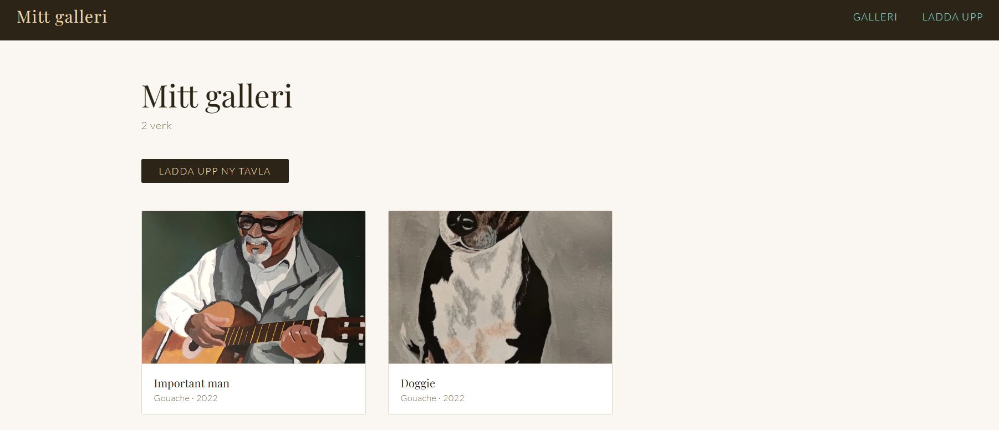
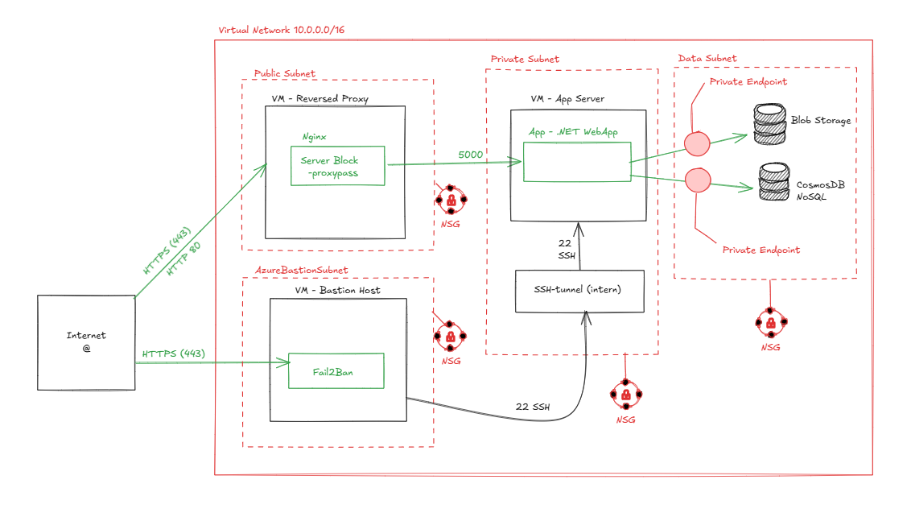
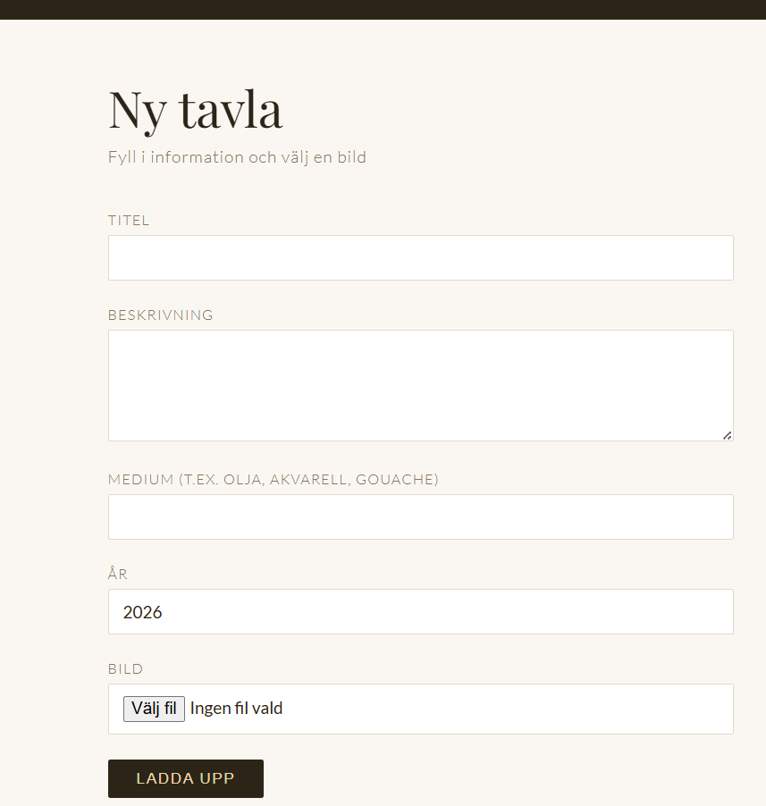
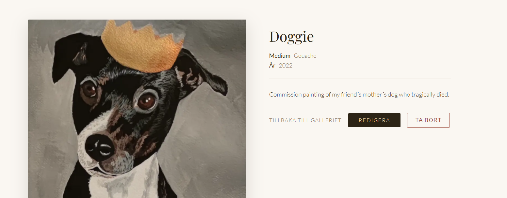

# 🎨 Mitt Bildgalleri

Ett enkelt och personligt bildgalleri byggt med .NET Razor Pages och Azure-tjänster. Ladda upp målningar, visa dem i ett galleri och hantera dem enkelt via webbgränssnittet.



---

## Teknisk stack

| Teknologi | Användning |
|---|---|
| .NET 10 Razor Pages | Webbapplikation |
| Azure Cosmos DB (NoSQL) | Lagring av metadata (titel, medium, år) |
| Azure Blob Storage | Lagring av bildfiler |
| Azure Virtual Network | Säker nätverksarkitektur |
| Azure Bastion | Säker administrativ åtkomst |
| GitHub Actions | CI/CD-pipeline |
| xUnit + Moq | Enhetstester och integrationstester |

---

## Arkitektur

Applikationen körs i ett säkert Azure Virtual Network (VNet) uppdelat i fyra subnät:



Varje subnät skyddas av NSG-regler (Network Security Groups) som begränsar trafiken till enbart det som är nödvändigt.

---

## Kom igång lokalt

### Förutsättningar

- [.NET 10 SDK](https://dotnet.microsoft.com/download)
- [Node.js](https://nodejs.org) (för Azurite)
- [Azure Cosmos DB Emulator](https://aka.ms/cosmosdb-emulator)

### Installation

**1. Klona repot**

```bash
git clone https://github.com/82marhal-bot/Inl-mning2.git
cd artgallery
```

**2. Installera Azurite (lokal Blob Storage-emulator)**

```bash
npm install -g azurite
```

**3. Starta emulatorerna**

Starta Azure Cosmos DB Emulator via startmenyn och vänta tills ikonen i systemfältet blir grön.

Starta sedan Azurite i terminalen:

```bash
azurite --silent --skipApiVersionCheck &
```

**4. Skapa databas i Cosmos DB Emulator**

Öppna `https://localhost:8081/_explorer/index.html` i webbläsaren och skapa:
- Database ID: `ArtGallery`
- Container ID: `Paintings`
- Partition key: `/id`

**5. Starta applikationen**

```bash
cd ArtGallery
dotnet run
```

Öppna `https://localhost:5001` i webbläsaren.

---

## Skärmdumpar

**Galleriet**


**Uppladdning**



**Detaljvy**



---

## Tester

Projektet har 10 tester uppdelade i tre kategorier:

| Kategori | Antal | Beskrivning |
|---|---|---|
| Enhetstester — CosmosDbService | 3 | Testar att data sparas, hämtas och raderas korrekt |
| Enhetstester — BlobStorageService | 2 | Testar uppladdning och borttagning av bildfiler |
| Integrationstester — Sidor | 5 | Testar att sidorna svarar korrekt via HTTP |

### Kör testerna

```bash
cd ArtGallery.Tests
dotnet test
```

Förväntat resultat:

```
Test summary: total: 10; failed: 0; succeeded: 10; skipped: 0
```

---

## CI/CD-pipeline

Projektet använder GitHub Actions för automatiserad bygge, testning och driftsättning.

```
Git Push
    │
    ▼
┌─────────────────────┐
│   CI — Build & Test │
│  dotnet build       │
│  dotnet test        │
└──────────┬──────────┘
           │ Godkänd
           ▼
┌─────────────────────┐
│   Infrastruktur     │
│  az bicep deploy    │
└──────────┬──────────┘
           │ Klar
           ▼
┌─────────────────────┐
│   CD — Deploy       │
│  dotnet publish     │
│  SSH via Bastion    │
│  systemctl restart  │
└─────────────────────┘
```


### Konfiguration av GitHub Secrets

För att CD-steget ska fungera och applikationen ska kunna kommunicera med Azure-tjänsterna, måste följande GitHub Secrets konfigureras i ditt repository under `Settings > Secrets and variables > Actions`:

| Secret | Beskrivning | Var hittar jag den i Azure? |
| :--- | :--- | :--- |
| `AZURE_CREDENTIALS` | Service Principal (JSON) | Skapas via `az ad sp create-for-rbac` |
| `SSH_PRIVATE_KEY` | Privat SSH-nyckel | Din lokala fil `~/.ssh/id_rsa` |
| `SSH_PUBLIC_KEY` | Publik SSH-nyckel | Din lokala fil `~/.ssh/id_rsa.pub` |
| `BASTION_HOST` | Bastionens publika IP-adress | Bastion -> Översikt -> Public IP |
| `APP_SERVER_IP` | App-serverns privata IP | VM -> Nätverk -> Privat IP (t.ex. 10.0.1.x) |
| `COSMOS_ENDPOINT` | URI till Cosmos DB | Cosmos DB -> Keys -> URI |
| `COSMOS_KEY` | Primary Key till Cosmos DB | Cosmos DB -> Keys -> Primary Key |
| `BLOB_CONNECTION_STRING` | Connection string till Storage | Storage Account -> Access Keys -> Connection string |
---

## Projektstruktur

```
ArtGallery/
├── Models/
│   └── Painting.cs              # Datamodell
├── Services/
│   ├── ICosmosDbService.cs      # Interface för Cosmos DB
│   ├── CosmosDbService.cs       # Implementering
│   ├── IBlobStorageService.cs   # Interface för Blob Storage
│   └── BlobStorageService.cs    # Implementering
├── Pages/
│   ├── Index.cshtml             # Galleriet
│   ├── Upload.cshtml            # Uppladdning
│   ├── Details.cshtml           # Detaljvy
│   ├── Edit.cshtml              # Redigera tavla
│   └── Image.cshtml             # Bildservare
└── wwwroot/
    └── css/site.css             # Styling

ArtGallery.Tests/
├── CosmosDbServiceTests.cs      # Enhetstester för Cosmos DB
├── BlobStorageServiceTests.cs   # Enhetstester för Blob Storage
└── PagesIntegrationTests.cs     # Integrationstester
```
